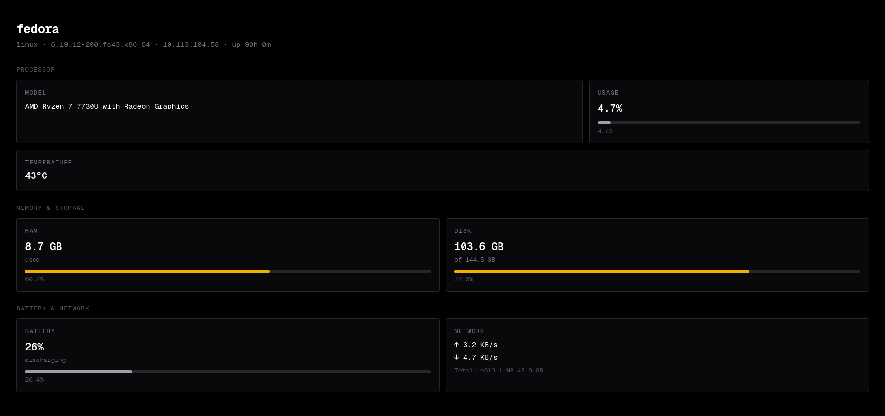

# System Monitor

A real-time system monitoring dashboard built with a **Go** backend and **Next.js** frontend. Displays live CPU, RAM, disk, battery, network, and temperature metrics through a minimal dark-themed UI.

Built as a learning project to explore Go's standard library, goroutines, and system-level programming.



## Features

- **CPU** — model name, real-time usage percentage, temperature (Linux/macOS)
- **RAM** — usage percentage and used bytes
- **Disk** — total, used, and usage percentage
- **Battery** — charge level and charging status (laptops only)
- **Network** — real-time upload/download speed and total traffic
- **System Info** — hostname, OS, kernel version, local IP, uptime
- **Cross-platform** — works on Linux, macOS, and Windows
- **Graceful shutdown** — clean server termination on Ctrl+C

## Tech Stack

| Layer    | Technology                                                     |
| -------- | -------------------------------------------------------------- |
| Backend  | [Go](https://go.dev) + [gopsutil](https://github.com/shirou/gopsutil) |
| Frontend | [Next.js](https://nextjs.org) + [React](https://react.dev) + [Tailwind CSS](https://tailwindcss.com) |
| API      | REST (JSON over HTTP)                                          |

## Project Structure

```
system-monitor/
├── backend/
│   ├── main.go          # Go API server — collects and serves system metrics
│   ├── go.mod
│   ├── go.sum
│   └── .env             # Backend port configuration
├── frontend/
│   ├── app/
│   │   ├── page.tsx     # Dashboard UI — fetches and displays metrics
│   │   ├── layout.tsx   # Root layout with metadata and fonts
│   │   └── globals.css  # Global styles
│   ├── package.json
│   └── .env.local       # Frontend API port configuration
└── .gitignore
```

## Getting Started

### Prerequisites

- [Go](https://go.dev/dl/) 1.21+
- [Node.js](https://nodejs.org/) 18+

### Backend

```bash
cd backend
go mod tidy
go run main.go
```

The API server starts on the port defined in `backend/.env` (default: `8080`).

**API endpoint:** `GET /api/status` — returns all system metrics as JSON.

### Frontend

```bash
cd frontend
npm install
npm run dev
```

Or for a production build:

```bash
npm run build
npm start
```

The dashboard opens at `http://localhost:3000` by default. If port 3000 is already in use, Next.js will automatically use the next available port (3001, 3002, etc.).

Make sure `NEXT_PUBLIC_API_PORT` in `frontend/.env.local` matches the backend port.

## Configuration

| File               | Variable               | Default | Description                  |
| ------------------ | ---------------------- | ------- | ---------------------------- |
| `backend/.env`     | `PORT`                 | `8080`  | Backend API server port      |
| `frontend/.env.local` | `NEXT_PUBLIC_API_PORT` | `8080`  | Port the frontend calls      |

## API Response Example

```json
{
  "operating_system": "linux",
  "kernel_version": "6.x.x",
  "hostname": "my-pc",
  "uptime_seconds": 34567,
  "local_ip": "192.168.1.100",
  "cpu_model": "AMD Ryzen 5 5600X",
  "cpu_usage_percent": 12.3,
  "cpu_temperature_celsius": 45.0,
  "ram_usage_percent": 58.2,
  "ram_used_bytes": 7516192768,
  "disk_total_bytes": 512110190592,
  "disk_used_bytes": 234881024000,
  "disk_usage_percent": 45.9,
  "battery_percent": -1,
  "is_charging": false,
  "network_sent_bytes": 1048576,
  "network_received_bytes": 5242880
}
```

## How It Works

1. The Go backend collects system metrics using [gopsutil](https://github.com/shirou/gopsutil) and exposes them via a REST API at `/api/status`.
2. CPU usage is measured in a background goroutine (updated every 2 seconds) to avoid blocking HTTP requests, since `cpu.Percent()` requires a 1-second sampling delay.
3. The Next.js frontend polls the API every 2 seconds and calculates real-time network speed by comparing consecutive readings.
4. Metrics that may not be available on all platforms (battery, temperature) gracefully return `-1`, and the frontend hides or shows "N/A" accordingly.

## License

This project is licensed under the [MIT License](LICENSE).
